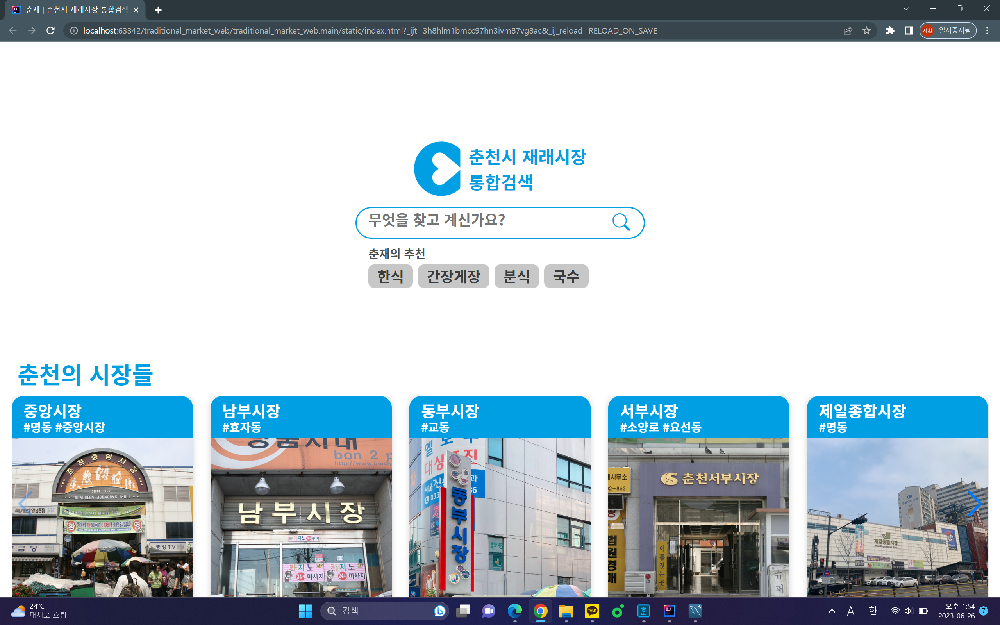

# Finding_Restaurant_in_Traditional_Market
2022년 한림대학교 [SW Week] 웹 해커톤 참가 작품
## 개요
&nbsp;2022년 한림대학교 [SW Week] 웹 해커톤 경진대회에서 제안한 주제로 해커톤을 진행한다. 제안된 주제는 춘천 내 전통 시장의 부흥을 위해 홍보 웹 페이지 제작하는 것이다.
## 팀원
1. 프론트엔드: 김강수 [빅데이터전공]
2. 백엔드: 김지환[빅데이터전공]   

## 개발 환경
* Spring boot
> Java   
> Mustache
* MySQL
* Javascript
## 실행 요약
   
춘천 재래시장의 먹거리를 홍보하기 위한 사이트를 제작했다. 해당 시장을 누르면 시장 속 식당 정보가 출력되어 나온다.
